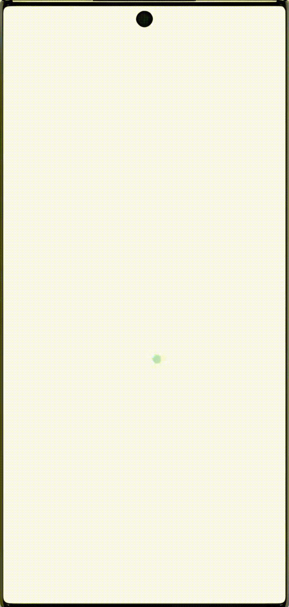

# Radial Particle Bloom Loading Animation

This Flutter project implements a captivating radial particle bloom loading animation. The animation features particles that emanate outwards in a circular pattern, creating a visually appealing bloom effect. It's designed to provide an engaging loading experience for users.

## Features

- Smooth, two-phase particle animation.
- Customizable particle color.
- Scalable animation size.

## Preview

## How it Works

The animation is built using Flutter's `CustomPainter` and `AnimationController`. It consists of two main phases:

1.  **Phase 1 (0-50% progress):** Small particles appear and scale up while rotating around a central point.
2.  **Phase 2 (50-100% progress):** The initial set of particles fades out, and a new set of particles appears on longer arms, also scaling and rotating.

The animation uses several `Tween` animations to control the scale, opacity, and rotation of the particles and the main container, creating a dynamic and fluid effect.

## Getting Started

To run this project:

1.  Ensure you have Flutter installed. For more information, see the [Flutter documentation](https://flutter.dev/docs/get-started/install).
2.  Clone the repository.
3.  Navigate to the project directory and run `flutter pub get`.
4.  Run the app using `flutter run`.

## Customization

- **Color:** The particle color can be changed by modifying the `color` parameter passed to the `RadialParticleBloomAnimationPainter` in `lib/main.dart`.
- **Size:** The size of the animation can be adjusted by changing the `Size` parameter of the `CustomPaint` widget.
- **Animation Timing and Curves:** The animation's behavior can be further customized by modifying the `Tween` values and `Curve` types within the `_RadialParticleBloomScreenState` in `lib/main.dart`.
